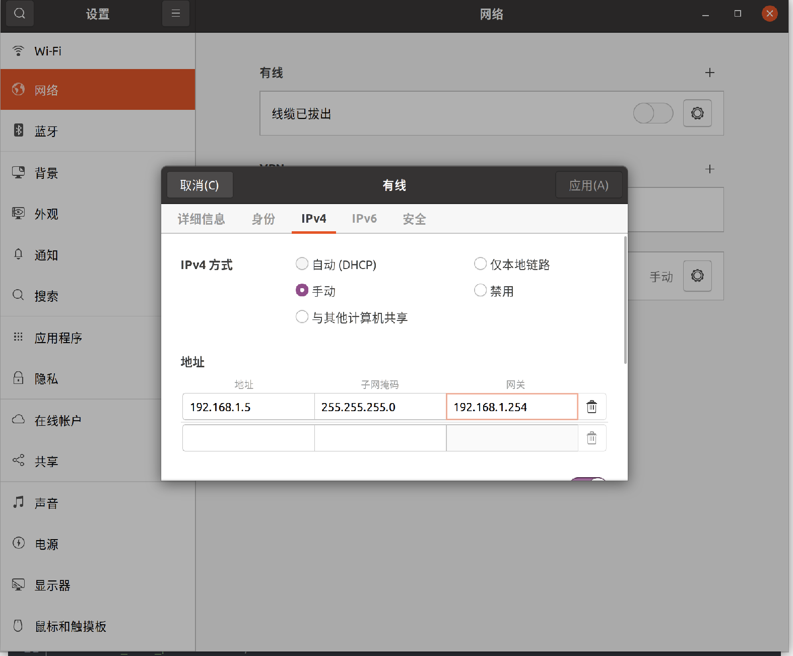

# mid360_fastlio
# Introduction
本项目展示了如何使用Livox Mid360激光雷达和FastLIO实现简单的机器人定位和运动控制。通过点云与IMU数据的融合，FastLIO提供了稳定的位姿估计，用于精确定位。同时，项目将三维点云地图转换为二维栅格图，并基于Odometry数据进行坐标变换和速度解算，从而实现了机器人在已知平面上到达目标点的简单路径跟踪，
这个项目利用 mid360 激光雷达 和 FastLIO 实现实时机器人定位，然后通过fastlio输出的里程计数据简单的到2维某个点，本工程并没有加上路径规划。输出的位置信息通过简单的pid位置环到达2维平面的某个点，只适用于已知的简单的场景。
也比较适合刚入门ros的小白。

本人也是初学ros不久（2024.10.27）

环境：
- ubuntu 20.04     
- ros noetic

## 手册
- [MID360用户手册](https://terra-1-g.djicdn.com/65c028cd298f4669a7f0e40e50ba1131/Mid360/20230727/Livox_Mid-360_User_Manual_CHS.pdf)
- [MID360快速开始手册](https://terra-1-g.djicdn.com/65c028cd298f4669a7f0e40e50ba1131/Mid360/Livox_Mid-360_Quick_Start_Guide_multi.pdf)

## 依赖项
打开终端
- 安装camke
```bash
sudo apt install cmake
```
- libeigen3-dev：安装 Eigen 3 库，用于高效的线性代数计算，在机器人定位和导航中大量使用。
```bash
sudo apt install libeigen3-dev
```
- libpcl-dev：安装 PCL 库，用于处理点云数据。
```bash
sudo apt install libpcl-dev
```
- 安装Sophus 是一个 C++ 库，专注于实现 Lie 群和 Lie 代数，特别是用于机器人学和计算机视觉中的三维旋转和平移操作。
``` bash
git clone https://github.com/strasdat/Sophus.git
cd Sophus
git checkout a621ff
mkdir build
cd build
cmake ../ -DUSE_BASIC_LOGGING=ON
make
sudo make install
```
上述步骤可能会报错
``` bash
/home/li/Sophus/sophus/so2.cpp:32:26: error: lvalue required as left operand of assignment
   unit_complex_.real() = 1.;
                          ^~
/home/li/Sophus/sophus/so2.cpp:33:26: error: lvalue required as left operand of assignment
```
打开cpp文件位置so2.cpp:32:26改为
``` bash
SO2::SO2()
{
  unit_complex_.real(1.);
  unit_complex_.imag(0.);
}
```

## LIVOX和FastLIO的配置流程
### 1. livox_sdk2，livox_ros_driver2建议都安在工作空间下，便于管理
- 安装[livox_sdk2](https://github.com/Livox-SDK/Livox-SDK2)，按照Readme的过程进行安装
- 安装[livox_ros_driver2](https://github.com/Livox-SDK/livox_ros_driver2), 还是按照readme文件进行安装。
### 2. 修改Livox mid360的配置
  
2.1. 修改电脑IP地址
- 安装完成后需要配置mid360的静态ip，打开设置，点击网络，选择ipv4手动。网上也有很多博客，也可以按照其他博客去修改。

2.2. 修改Livox mid360 IP
- 打开  work_space/src/livox_ros_driver2/config/MID360_config.json,需要知道雷达的S/N码，位置在购买的盒子上的标签上。！！！注意work_space/src/livox_ros_driver2/launch_ROS1/msg_MID360.launch文件，也需要将雷达对应的SN码进行修改，然后才能使用，此步骤千万不能遗忘，默认功能包参数是100000000000，修改成雷达对应的SN码


```javascript
{
  "lidar_summary_info" : {
    "lidar_type": 8
  },
  "MID360": {
    "lidar_net_info" : {
      "cmd_data_port": 56100,
      "push_msg_port": 56200,
      "point_data_port": 56300,
      "imu_data_port": 56400,
      "log_data_port": 56500
    },
    "host_net_info" : {
      "cmd_data_ip" : "192.168.1.5",  	# <-这里和修改后的电脑ip一致
      "cmd_data_port": 56101,
      "push_msg_ip": "192.168.1.5",  	# <-这里和修改后的电脑ip一致
      "push_msg_port": 56201,
      "point_data_ip": "192.168.1.5",  	# <-这里和修改后的电脑ip一致
      "point_data_port": 56301,
      "imu_data_ip" : "192.168.1.5",  	# <-这里和修改后的电脑ip一致
      "imu_data_port": 56401,
      "log_data_ip" : "",
      "log_data_port": 56501
    }
  },
  "lidar_configs" : [
    {
      "ip" : "192.168.1.152",		  	# <-这里是Livox mid360的ip 只需要改ip的后两位，即S/N码的后两位
      "pcl_data_type" : 1,
      "pattern_mode" : 0,
      "extrinsic_parameter" : {
        "roll": 0.0,
        "pitch": 0.0,
        "yaw": 0.0,
        "x": 0,
        "y": 0,
        "z": 0
      }
    }
  ]
}
```
### 3.FASTLIO配置
``` bash
$A_ROS_DIR$ 是你自己的工作空间
cd ~/$A_ROS_DIR$/src
git clone https://github.com/hku-mars/FAST_LIO.git
cd FAST_LIO
git submodule update --init
#我在这一步时遇到过，应该是网络问题
fatal: 无法访问 'https://github.com/hku-mars/ikd-Tree.git/'：gnutls_handshake() failed: The TLS connection was non-properly terminated.
fatal: 无法克隆 'https://github.com/hku-mars/ikd-Tree.git' 到子模组路径 '/home/li/mid360_ws/src/FAST_LIO/include/ikd-Tree'
克隆 'include/ikd-Tree' 失败。按计划重试
正克隆到 '/home/li/mid360_ws/src/FAST_LIO/include/ikd-Tree'...
子模组路径 'include/ikd-Tree'：检出 'e2e3f4e9d3b95a9e66b1ba83dc98d4a05ed8a3c4'
子模组路径 'include/ikd-Tree'：检出 'e2e3f4e9d3b95a9e66b1ba83dc98d4a05ed8a3c4

#如遇到可以如下方法试试
# 删除已克隆的 ikd-Tree 文件夹
rm -rf /home/li/mid360_ws/src/FAST_LIO/include/ikd-Tree

# 进入 FAST_LIO 文件夹重新更新子模块
cd /home/li/mid360_ws/src/FAST_LIO
git submodule update --init --recursive

cd ../..
```
因为用的是livox_ros_driver2，需要修改一些地方。CmakeLists文件修改find_package。package.xml也需要修改，src中的cpp文件也需要修改。如果你用的vscode你可以ctrl+F进行快速查找，如下
#### 修改前：
```javascript
find_package(catkin REQUIRED COMPONENTS
  geometry_msgs
  nav_msgs
  sensor_msgs
  roscpp
  rospy
  std_msgs
  pcl_ros
  tf
  livox_ros_driver		# <-修改这里
  message_generation
  eigen_conversions
)
```
#### 修改后：
```javascript
find_package(catkin REQUIRED COMPONENTS
  geometry_msgs
  nav_msgs
  sensor_msgs
  roscpp
  rospy
  std_msgs
  pcl_ros
  tf
  livox_ros_driver2		# <-修改这里
  message_generation
  eigen_conversions
)
```
### 修改FAST_LIO的package.xml
#### 修改前：
```javascript
<build_depend>livox_ros_driver</build_depend>
<run_depend>livox_ros_driver</run_depend>
```
#### 修改后：
```javascript
<build_depend>livox_ros_driver2</build_depend>
<run_depend>livox_ros_driver2</run_depend>
```
### 修改FAST_LIO的头文件引用
分别打开FAST_LIO/src/preprocess.h、FAST_LIO/src/laserMapping.cp
#### 修改前：
```javascript
#include <livox_ros_driver/CustomMsg.h>
```
#### 修改后：
```javascript
#include <livox_ros_driver2/CustomMsg.h>
```
### 修改FAST_LIO的命名空间
分别打开FAST_LIO/src/preprocess.h、FAST_LIO/src/preprocess.cpp、FAST_LIO/src/laserMapping.cpp中的命名空间，有多处需要修改
#### 修改前：
```javascript
livox_ros_driver::
```
#### 修改后：
```javascript
livox_ros_driver2::
```
###全部修改完成后，进入fastlio所在的工作空间，然后进行编译
``` bash
catkin_make
source devel/setup.bash
#将devel/setup.bash添加到~/.bashrc
gedit ~/.bashrc
#将devel/setup.bash文件的路径添加到此文件末尾，然后保存退出
source ~/.bashrc
```
编译成功后可以接上mid360测试fastlio，如下：
``` bash
roslaunch livox_ros_driver2 msg_MID360.launch
#新打开一个终端
roslaunch fast_lio mapping_mid360.launch
```
然后你就会在rviz上看见如图，fastlio建好的图会自动存在PCD文件夹中


## 使用里程计跑点
直接使用里程计跑固定的点的时候需要确保每一次的初始位置都要一样，这个很重要。不然会有误差，所以这个只适合跑固定的点，不能在复杂的场景使用。
FastLIO 是一种高效的激光雷达惯性里程计（LIO）算法，主要用于实时估计带有 IMU（惯性测量单元）的激光雷达在三维空间中的位置和姿态。它的原理基于激光雷达和 IMU 的融合，通过将点云数据与 IMU 数据结合来提供更加鲁棒和精确的位姿估计。

如上图所释，fastlio订阅了雷达的点云话题和mid360内置的imu话题，然后fastlio的laserMapping节点融合后估计出雷达自身的姿态，发布了里程计话题/Odometry。我们要用到的就是这个。
### 将PCD文件中的三维点云地图scans.pcd,转化成二维栅格地图。
- 利用octomap_server功能包
###### 安装octomap
```bash
sudo apt install ros-noetic-map-server
# 输入下面指令安装octomap.
sudo apt-get install ros-noetic-octomap-ros #安装octomap
sudo apt-get install ros-noetic-octomap-msgs
sudo apt-get install ros-noetic-octomap-server
# 安装octomap 在 rviz 中的插件
sudo apt-get install ros-noetic-octomap-rviz-plugins
```

FAST_LIO/launch目录下添加` PCD2Map.launch `和` build_Map.launch `文件，` PCD2Map.launch `是启动ctomap_server的。具体看看这两个launch文件。
```bash
#clone在src目录下，FAST_LIO/launch目录下添加` PCD2Map.launch `和` build_Map.launch `文件
git clone https://github.com/BUJIAOATIAN/Robot-Localization_mid360.git
```
输入以下命令
```bash
roslaunch fast_lio build_Map.launch
```
如果你对你建的图比较满意，你可以使用以下命令保存map
```bash
# /projected_map是octomap_server节点发布的二维栅格图话题，-f /home/li/mid360_ws/src/FAST_LIO/PCD/scans是我保存的路径，你可以改成你的
rosrun map_server map_saver map:=/projected_map -f /home/li/mid360_ws/src/FAST_LIO/PCD/scans
```
检查在fast_lio/PCD下中保存的2d地图`scans.yaml`,确保其中参数`origin`[x,y,yaw]不能是nan，如果yaw是nan的话，将其设置为0.


### 坐标系映射
1. 发布tf，` <node pkg="tf2_ros" type="static_transform_publisher" name="tf_pub_3" args="0 0 0 0 0 0 map camera_init" /> `,camera_init frame到map frame的静态映射.
2. 发布tf，map frame到body_2d frame。body_2d是雷达body在二维的投影，以下部分在nav_odom_pkg里的` tf_2d_odom_broadcaster `节点中
 ` transform_broadcaster.setOrigin( tf::Vector3(robot_pose_x, robot_pose_y, 0.0) );
 transform_broadcaster.setRotation( tf::Quaternion(0, 0, robot_oriation_z, robot_oriation_w) );
 broadcaster.sendTransform(tf::StampedTransform(transform_broadcaster, ros::Time::now(), "map", "body_2d")); `
 
3. 将话题/Odometry 中的偏航角，x和y的坐标，发布在map坐标系下
```javascript
#在tf_2d_odom_broadcaster节点下
// 创建Odometry消息
    nav_msgs::Odometry odom;
    odom.header.stamp = ros::Time::now();
    odom.header.frame_id = "map";  // 发布在map坐标系下

    // 设置位置 (x, y, z)
    odom.pose.pose.position.x = robot_pose_x;
    odom.pose.pose.position.y = robot_pose_y;
    odom.pose.pose.position.z = 0.0;

    // 设置方向 (仅考虑平面上的z轴旋转)
    odom.pose.pose.orientation.z = robot_oriation_z;
    odom.pose.pose.orientation.w = robot_oriation_w;

    // 发布Odometry消息
    odom_pub.publish(odom);
```

有了这些我们就可以，解算机器人底盘坐标系下的速度了

### 解算
1.发布了` /body_2d_odom `话题，有了偏航角和在map坐标系下的坐标


上图解释了如何将速度转化到机器人底盘坐标下，详情请看odom_2d_pid_to_vel.cpp，主要就是调用和一个pid算法。解算出来了底盘的x_vel y_vel 和 yaw_vel 的角速度，通过/cmd_vel话题发布。我这里还加了速度的平滑处理，`velocity_smoother_ema`(https://github.com/seifEddy/velocity_smoother_ema)
节点订阅/cma_vel话题,处理后发布/smooth_cmd_vel话题。

- pid和平滑处理 需要根据自己的机器人底盘进行参数调整

### 发送数据
- 通过串口发送给下位机 [可参考](https://blog.csdn.net/weixin_43972102/article/details/130874314?ops_request_misc=%257B%2522request%255Fid%2522%253A%2522BD9C69A2-9F1A-414A-A2ED-54D60C26B06E%2522%252C%2522scm%2522%253A%252220140713.130102334..%2522%257D&request_id=BD9C69A2-9F1A-414A-A2ED-54D60C26B06E&biz_id=0&utm_medium=distribute.pc_search_result.none-task-blog-2~all~sobaiduend~default-2-130874314-null-null.142^v100^pc_search_result_base8&utm_term=ros%E4%BD%BF%E7%94%A8%E4%B8%B2%E5%8F%A3%E9%80%9A%E4%BF%A1&spm=1018.2226.3001.4187)，你也可以直接用我的
```bash
#安装
sudo apt-get update
sudo apt-get install ros-noetic-serial
```
- 运行以下命令来授予串口设备文件
```bash
sudo chmod 666 /dev/ttyUSB0
```


## 也可以直接在终端输入  启动全部项
```bash
roslaunch nav_odom_pkg localize.launch
```

## 结语
这个项目只是简单的调用了fastlio的里程计数据，然后进行简单的跑点。pointlio fastlio2和fasterlio调用过程大致思路也是这样的。
- 如果要使用路径规划的话，可以自行查阅资料。也可以参考这个[仓库](https://github.com/66Lau/NEXTE_Sentry_Nav?tab=readme-ov-file)和这个[ros2的框架](https://gitee.com/SMBU-POLARBEAR/pb_rm_simulation#https://gitee.com/link?target=https%3A%2F%2Fflowus.cn%2Flihanchen%2Ffacb28a9-5d34-42a7-9bc8-630a182c3571)


